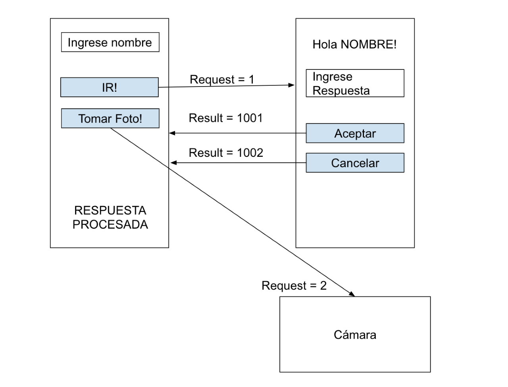

# Clase01

. Armar una app con:

. EditText para ingresar nombre y botón para ir a otra activity.
. Cuando se apriete el botón se debe abrir la segunda activity y mostrar en un TextView un “Hola NOMBRE_INGRESADO_EN_PRIMERA_PANTALLA”. Se debe recibir el nombre como parte del intent.
. En la segunda pantalla un botón para volver a la primera pantalla y que le devuelva como result el mensaje escrito en otro EditText propio de la segunda pantalla.
. Manejar la rotación de pantalla haciendo un saveinstancestate y chequeando eso en el on-create para las dos pantallas.
. La primer pantalla chequea el result y en base a eso muestra la respuesta procesada en un TextView pegado a la parte inferior de la pantalla donde si el usuario ingresó algo en la segunda pantalla lo menciona y sino ingresó nada (lo chequeamos con el result code, no vale comparar por string vacio en la primera pantalla) muestra un mensaje diciendo que el usuario canceló la operación.
. Todo debe estar traducido tanto a inglés como español.
. Adicional: Agreguen un segundo botón en la primer activity que abra la cámara con otro request code y muestre como resultado un diálogo (investigar como se hace el diálogo) diciendo si el usuario tomó la foto con éxito o si canceló la captura.