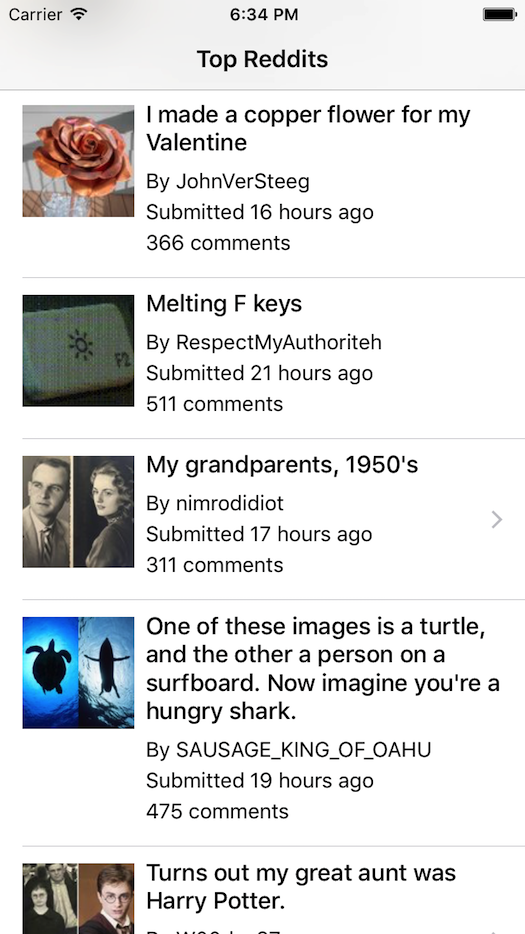
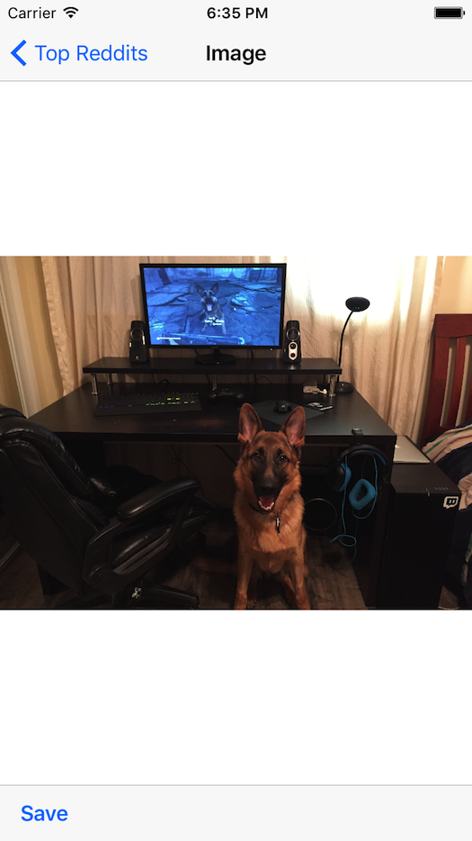

# Clase03

**Temas vistos:**
* Repaso de Activity Lifecycle e Intent, Results.
* Repaso de Recycler View, ViewHolder y Adapter
* Tabla con scroll infinito y paginado dinámico al hacer scroll
* Main thread y brackground threads
* Async Tasks
* Mención sobre Services, BroadcastReceivers y Main Thread Looper
* Llamadas a servicios con Retrofit 
* Descarga de imágenes con Picasso

**Tarea:**
* Hacer un app lector de Reddits o similiar (en Kotlin).
* Opcional: Agregar scroll infinito
* Opcional: Ver imagen full screen al elegir una fila de la tabla.
* Opcional: Implementar Pull to Refresh (a esto no lo vimos pero el que quiera go ahead).

**API a consumir:**
[https://www.reddit.com/top.json](https://www.reddit.com/top.json)

**Pantalla principal:**

**Pantalla de detalle (opcional):**

**App de Ejemplo (no para copiar obviamente):**
[https://github.com/marcelobusico/reddit-android-app](https://github.com/marcelobusico/reddit-android-app)
